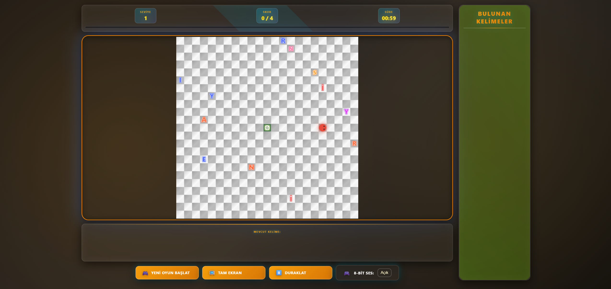

# 🐍 Yılanla Kelime Avı (Snake Word Hunter)

**[Oyunu Tarayıcıda Oynamak İçin Tıklayın](https://MesutKaval.github.io/Yilanla-Kelime-Avi-Oyunu/)** 🚀

Klasik Yılan (Snake) oyununun heyecanını Kelime Bulmaca zekasıyla birleştiren, modern ve tempolu bir web oyunu.

*(Buraya oyunun ekran görüntüsünü ekleyebilirsiniz)*

## 🎮 Nasıl Oynanır?

Yılanı yöneterek harfleri toplayın ve anlamlı kelimeler oluşturun! 
- **Hareket**: Yön Tuşları (⬅️⬆️⬇️➡️) veya W, A, S, D
- **Kelime Onaylama**: Topladığınız harflerle kelime oluşturunca **Merkez Portal'a** (ortadaki yeşil alan) girin.
- **Seviye Geçişi**: Hedeflenen harf sayısına ulaşınca seviye tamamlanır. Sonraki seviyeye geçmek için **Boşluk (Space)** tuşuna basın.

## 🌟 Oyun Özellikleri

*   **10 Farklı Seviye**: Giderek zorlaşan 10 seviye. Her seviyede yılan hızlanır ve gereken harf sayısı artar.
*   **Dinamik Kelime Doğrulama**: 50.000+ kelimelik Türkçe sözlük.
*   **Ceza Sistemi**: Geçersiz kelime girerseniz, kelime uzunluğu kadar "Duvar Portalı" haritada belirir!
*   **Görsel ve Ses Efektleri**: 8-bit retro sesler, parçacık efektleri ve neon grafikler.

## 🌀 Portal Rehberi

Oyunda stratejik öneme sahip özel portallar bulunur. İşte ikonları ve görevleri:

| İkon | Adı | Açıklama |
| :---: | --- | --- |
|  | **Merkez Portal** | Kelimeyi onaylamak için buraya girin. Oyunun kalbidir. |
|  | **Geri Al Portalı** | **5 harfli** bir kelime bulduğunuzda çıkar. Son aldığınız harfi yılanın kuyruğundan siler. Kullanılınca kaybolur, koşullar sağlandığında tekrar çıkar. |
|  | **Zaman Portalı** | **6+ harfli** kelimelerde çıkar. Aldığınızda süreye **+30 saniye** ekler. Kullanılınca kaybolur, koşullar sağlandığında tekrar çıkar. |
|  | **x2 Puan Portalı** | **7+ harfli** kelimelerde çıkar. Bu portala geçerli bir kelimeyle girerseniz **2 katı puan** alırsınız. |
|  | **Seviye Atlama Portalı** | **8+ harfli** kelimelerde çıkar. Bu portala girdiğinizde (boş bile olsa) **direkt sonraki seviyeye** geçersiniz. |
|  | **Duvar (Ceza) Portalı** | Geçersiz bir kelime onaylarsanız ceza olarak çıkar. Yılan bu duvara çarparsa **OYUN BİTER**. |

> **Not:** Geri Al, Zaman, x2 ve Seviye Atlama portalları haritada aynı anda yalnızca birer tane bulunabilir. Kullanılmayan portallar bir sonraki seviyeye taşınır.

## 🚀 Çalıştırma seçenekleri

### Seçenek 1: Canlı Oyna (Önerilen)
Hiçbir şey indirmeden oynamak için şu linke tıklayın:
👉 **[https://MesutKaval.github.io/Yilanla-Kelime-Avi-Oyunu/](https://MesutKaval.github.io/Yilanla-Kelime-Avi-Oyunu/)**

### Seçenek 2: Bilgisayarında Çalıştır
İnternet olmadan oynamak isterseniz:
1.  Bu repoyu indirin.
2.  `oyunu_baslat.bat` dosyasına çift tıklayın. (Bilgisayarınızda Python yüklü olmalıdır)

## 🛠️ Teknolojiler

*   HTML5 Canvas
*   Vanilla JavaScript (ES6+)
*   CSS3 (Modern Tasarım)

## 📄 Lisans

Bu oyun **Mesut Kaval** tarafından tasarlanmış olup, kodlama sürecinde yapay zeka araçlarından yararlanılmıştır. Açık kaynak kodludur ve özgürce kullanılabilir.
